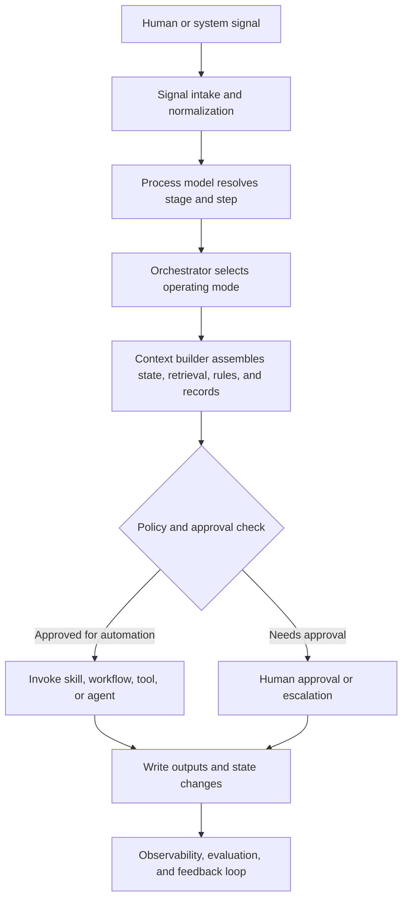

# Workplace AI Process Decomposition Framework

## Purpose

This document defines a practical framework for converting line-of-business workflows into AI-enabled operating capabilities. It is designed to help business leaders, process owners, architects, and engineering teams move from a high-level process map to an implementation model that uses the right combination of skills, tools, workflows, agents, memory, approvals, and governance controls.

The goal is not to produce a generic chatbot. The goal is to improve a business process with reliable, auditable, and measurable AI-assisted execution.

## Why This Matters

Most AI initiatives fail at the process layer, not the model layer. Teams often start by building a capability such as summarization, retrieval, or an agent, but they have not defined the following:

- The business outcome the workflow must produce.
- The steps and decisions that make up the workflow.
- The inputs and sources of truth required for each step.
- The conditions under which AI may assist, draft, or act.
- The approvals, escalation paths, and rollback paths required for safe operation.
- The metrics that determine whether the process is improving.

Process decomposition solves that problem. It creates a shared language between business and technical teams so that implementation artifacts are based on process logic instead of prompt fragments.

## Outcomes

Using this framework should produce the following outcomes:

- A decomposed process model that shows steps, decisions, inputs, systems, approvals, and exceptions.
- A clear automation boundary for each process step.
- A consistent translation from process steps into skills, tools, workflows, agents, and human approvals.
- A reference architecture for runtime orchestration, knowledge grounding, policy enforcement, and observability.
- A governance model that treats AI as part of an operating process rather than a disconnected experiment.

## Core Principles

1. Be process-centric, not chatbot-centric.
2. Separate business capabilities from technical connectors.
3. Use models for interpretation and generation, but use enterprise data and policy for justification and action.
4. Store durable business state outside the model.
5. Make governance, approvals, and auditability part of the runtime design.
6. Evaluate end-to-end business outcomes, not only model output quality.
7. Roll out assistive capabilities before autonomous execution.

## Definitions

### Process

A business workflow that exists to produce a repeatable business outcome such as handling a service case, onboarding a vendor, triaging a request, approving an invoice, or resolving an exception.

### Step

A unit of work within a process that has one primary goal, one main decision type, one primary source of truth, and one accountable owner.

### Decision

A point in the workflow where the process branches, escalates, approves, rejects, routes, or applies a policy.

### Skill

A reusable business capability with a stable contract. Examples include summarize case history, classify request type, detect missing information, draft response, or recommend routing destination.

### Tool or Plugin

A technical interface that reads from or writes to a system. Examples include creating a CRM record, updating ticket status, retrieving a contract, or posting an approval task.

### Workflow

An orchestrated sequence of steps that coordinates multiple capabilities, tools, and approvals.

### Agent

A bounded adaptive coordinator that can choose among available tools and skills to achieve a goal when the path is not fully fixed in advance. Agents are useful, but they are not the default implementation unit for every process.

### Policy or Guardrail

An enforcement layer that determines what the system may do based on risk, permissions, confidence, data classification, or business rules.

### Process State

Durable workflow memory tied to a case, transaction, request, or approval path. This includes pending approvals, prior decisions, unresolved exceptions, and recorded outputs. Process state belongs in workflow state stores and systems of record, not only in model context.

## The Framework At A Glance

The framework has seven layers:

1. Signal intake and normalization.
2. Process modeling and decomposition.
3. Capability mapping and automation boundary.
4. Runtime orchestration and knowledge assembly.
5. Decision, approval, and exception handling.
6. Governance, evaluation, and observability.
7. Operating model, rollout, and change management.

The implementation flow is:

1. Choose a bounded process.
2. Decompose it into steps, decisions, inputs, outputs, systems, approvals, and exceptions.
3. Classify each step by operating mode and AI task type.
4. Translate each step into the correct execution unit.
5. Build the orchestration, context, and control layers.
6. Evaluate in shadow mode, then pilot, then controlled rollout.

## Phase 1: Process Selection

Choose a process that is valuable enough to matter and bounded enough to control.

### Recommended Selection Criteria

Score candidate processes across the following dimensions:

| Dimension | What To Look For | Why It Matters |
| --- | --- | --- |
| Business value | Cost reduction, cycle time reduction, revenue impact, risk reduction | Ensures the effort is worth doing |
| Volume | Frequent cases or repeated work | Produces enough repetition to learn and standardize |
| Variance | Some variation, but not pure chaos | Good AI targets have patterns with bounded exceptions |
| Data readiness | Access to records, history, documents, and policies | AI quality depends on grounded inputs |
| Approval structure | Existing approvers and policy thresholds | Makes it easier to introduce human-in-the-loop controls |
| Error tolerance | Recoverable mistakes vs irreversible decisions | Determines how much autonomy is safe |
| Ownership | Clear business owner and technical owner | Prevents orphaned capabilities |

### Good First Candidates

- Intake and triage.
- Case summarization.
- Document extraction.
- Routing and next-best-action recommendation.
- Exception preparation.
- Response drafting with approval.

### Poor First Candidates

- Processes with no consistent source of truth.
- Processes with undefined approvals or conflicting policies.
- Processes where a single error causes irreversible harm.
- Processes with no measurable outcome.

## Phase 2: Process Decomposition

### Decomposition Rule

Keep breaking down the workflow until each step has:

- One dominant goal.
- One main decision type.
- One primary source of truth.
- One accountable owner.

If a step has multiple decision types, multiple sources of truth, or no clear owner, it is still too large.

### Required Process Map Fields

For every process, capture:

- Process name.
- Business objective.
- Trigger.
- Stages.
- Steps.
- Decisions.
- Inputs.
- Outputs.
- Systems involved.
- Human roles.
- Approvals.
- Exception paths.
- SLA or time boundary.
- Compliance or policy constraints.
- Process owner.
- Metrics.

### Recommended Step Record

Use the following structure for each step:

```yaml
step_id: STEP-001
step_name: Intake request
stage: Intake
goal: Establish a complete and valid request record
trigger: New email or form submission received
inputs:
  - customer email
  - attachments
  - account metadata
source_of_truth:
  - CRM account record
  - request policy
decision_type: completeness check
systems:
  - email platform
  - CRM
human_roles:
  - service agent
outputs:
  - normalized request record
  - missing information flag
approvals_required: false
exceptions:
  - missing attachment
  - duplicate request
sla: 30 minutes
owner: service operations
success_metrics:
  - complete request rate
  - intake time
```

## Phase 3: Signal Inventory

The quality of AI execution depends on the quality of process inputs. Inputs should be treated as signals, not just content.

### Human Signals

Human-originated signals are valuable because they contain intent, ambiguity, confidence, and escalation patterns.

| Signal Type | Examples | Why Valuable |
| --- | --- | --- |
| Email | Subject, body, thread, recipients, timestamps | Contains request context, urgency, and routing cues |
| Chat | Conversations, mentions, replies, channel context | Reveals live intent, clarification loops, and handoff patterns |
| Files | PDFs, spreadsheets, screenshots, forms, contracts | Often contain primary source material for extraction or validation |
| Comments | Inline comments, review notes, approval annotations | Show objections, reasoning, and exception details |
| Edits | Redlines, corrections, field changes | Reveal user overrides and recurring failure modes |
| Approvals | Explicit approval, soft approval, rejection, delegation | Drive policy-aware execution and accountability |
| Meetings and calls | Notes, transcripts, action items | Surface commitments, unresolved issues, and commitments |
| Escalations | Forwarding, urgent tags, leader involvement | Signal risk, uncertainty, or policy conflict |

### System Signals

System signals are often more reliable than free-form human content and should be used whenever possible.

| Signal Type | Examples | Why Valuable |
| --- | --- | --- |
| Record state | Case status, invoice status, onboarding stage | Anchors the workflow to durable state |
| Events | Submission, update, cancellation, breach | Triggers workflow progression |
| Master data | Customer tier, product catalog, employee profile | Provides structured context for decisions |
| History | Prior approvals, case outcomes, reopen rates | Supports recommendation and exception handling |
| Entitlements | Access rights, support level, policy applicability | Constrains what is allowed |
| Telemetry | Error counts, usage, wait times, threshold breaches | Supports prioritization and anomaly detection |

### Model Knowledge

Model knowledge is useful, but it must be used in the right role.

| Knowledge Type | Use Case | Constraint |
| --- | --- | --- |
| General language knowledge | Summarization, extraction, rewriting, explanation | Safe for low-risk interpretation tasks |
| Enterprise retrieval | SOPs, policies, contracts, case history, knowledge base | Preferred for current business facts and policy-backed outputs |
| Procedural knowledge | Decision rubrics, taxonomies, routing rules, templates | Should be maintained by business owners and versioned |
| Exemplars | Approved outputs, resolved cases, model examples | Useful for consistency and tone |
| Structured business data | Records, metrics, transaction state | Required for accurate execution and audit |

### Signal Quality Dimensions

For every signal source, score the following:

- Freshness.
- Completeness.
- Permission sensitivity.
- Reliability.
- Source-of-truth status.
- Retention requirement.
- Audit requirement.

## Phase 4: Automation Boundary

Each step must be assigned one operating mode.

| Mode | Description | Typical Use |
| --- | --- | --- |
| Human only | No AI action other than optional supporting information | High-risk judgment or undefined policy |
| AI assist | AI helps analyze or summarize, but humans act | Early rollout, low trust environments |
| AI draft plus approve | AI produces a draft, human reviews and approves | Common for communications and recommendations |
| AI act within policy | AI executes allowed actions inside defined rules | Good for bounded, reversible actions |
| Deterministic automation | No model needed | Stable rules with low ambiguity |

The automation boundary is the first safety decision. It prevents teams from applying agentic execution where a recommendation pattern is the better fit.

## Phase 5: Capability Mapping

Map each process step to a dominant AI task pattern.

| Task Pattern | Description | Example |
| --- | --- | --- |
| Extract | Pull structured facts from unstructured input | Extract fields from an invoice |
| Classify | Assign label, type, or category | Identify request type |
| Summarize | Compress history into usable context | Summarize a case for escalation |
| Retrieve | Find relevant enterprise context | Retrieve policy and prior cases |
| Compare | Compare input against a rule or baseline | Compare contract clauses to standard terms |
| Recommend | Suggest the best next step | Recommend routing destination |
| Generate | Produce a draft or response | Draft customer email |
| Route | Send work to the right queue or role | Route case to finance team |
| Decide | Choose a path under policy | Decide whether to request approval |
| Execute | Carry out an allowed action | Update status or create a record |

Each step should have one dominant pattern even if it uses several secondary ones.

## Phase 6: Translate Process To The Right Technical Artifact

It is not all about skills and plugins. Those are only two artifact types in a larger implementation model.

### Translation Rules

| Process Need | Best Artifact | Why |
| --- | --- | --- |
| Reusable business task with stable inputs and outputs | Skill | Makes the business capability portable and composable |
| Read or write operation on a system | Tool or plugin | Creates explicit system boundary and permissions |
| Multi-step sequence with fixed order | Workflow | Best for deterministic orchestration |
| Multi-step goal with variable path | Agent | Best when adaptive tool selection is required |
| Runtime enforcement of rules | Policy or guardrail | Keeps control logic out of prompt-only behavior |
| Long-running context across sessions | Memory or state store | Preserves durable workflow history |
| Accountability or high-risk authorization | Human approval | Maintains ownership and control |

### Skill Contract Template

Use this structure for every skill:

```yaml
skill_id: SKILL-CASE-SUMMARY
name: Summarize case history
purpose: Produce a concise and accurate summary of the case for agent review
trigger: Case reaches escalation stage
required_inputs:
  - case history
  - latest customer message
  - account tier
optional_inputs:
  - prior escalations
  - product telemetry
output_schema:
  summary: string
  recommended_next_action: string
  open_questions: list[string]
source_of_truth:
  - case management system
  - approved escalation rubric
tool_dependencies:
  - get_case_history
  - get_account_profile
approvals_required: false
latency_target_seconds: 10
audit_fields:
  - request_id
  - case_id
  - model_version
  - prompt_version
  - source_references
success_metrics:
  - summary_accuracy
  - reviewer_acceptance_rate
  - time_saved_minutes
failure_handling:
  - missing_case_history
  - permission_denied
```

### Tool or Plugin Contract Template

```yaml
tool_id: TOOL-CRM-UPDATE
name: Update CRM case status
action_type: write
system: CRM
required_inputs:
  - case_id
  - new_status
permissions:
  - service_case_write
side_effects:
  - changes customer-visible record
audit_fields:
  - actor
  - timestamp
  - prior_value
  - new_value
rollback_strategy: restore previous status
```

### Agent Usage Rule

Use an agent only when all of the following are true:

1. The task requires multi-step reasoning.
2. The path cannot be fully predetermined.
3. The agent can operate inside well-defined tool boundaries.
4. There are explicit checkpoints, policies, or approvals.
5. The failure cost is acceptable or bounded by rollback.

If those conditions are not true, prefer a workflow plus skills and tools.

## Reference Architecture

### Layer 1: Signal Intake And Normalization

The intake layer ingests signals from email, chat, files, forms, meetings, and systems of record. It normalizes them into a canonical process event schema.

Recommended canonical fields:

- Event ID.
- Process ID.
- Case or transaction ID.
- Source type.
- Source system.
- Actor or role.
- Timestamp.
- Thread or conversation ID.
- Attached artifacts.
- Permissions context.
- Retention class.
- Urgency or priority.
- Initial confidence or ambiguity indicators.

### Layer 2: Process Model

The process model resolves where the event belongs in a workflow. It answers the following:

- Which process is this?
- Which stage is currently active?
- Which step is next?
- What are the required inputs?
- What policies apply?
- What approvals may be required?

### Layer 3: Capability Registry

The capability registry stores definitions for:

- Skills.
- Tools or plugins.
- Workflows.
- Agents.
- Policies.
- Templates.
- Prompt or instruction assets.

Every capability should be versioned and owned.

### Layer 4: Runtime Orchestrator

The orchestrator receives a process event, resolves process state, selects the appropriate execution unit, assembles context, executes the task, and records outcomes.

The orchestrator is responsible for:

- Loading the current process definition.
- Selecting the step-level operating mode.
- Determining whether to invoke a skill, workflow, tool, or agent.
- Passing approved context and references.
- Requesting approvals when required.
- Writing outcomes and state transitions back to systems of record.

### Layer 5: Knowledge And Context Assembly

The context layer assembles the information needed to execute a step safely.

Context should draw from:

- Process instructions.
- Decision rubrics.
- Retrieval over enterprise documents.
- Case or transaction history.
- Structured business records.
- Exemplars.
- Allowed model priors.

The rule is straightforward:

- Use model knowledge to interpret language and synthesize.
- Use enterprise retrieval and structured systems to justify business facts and actions.

### Layer 6: Memory And State

Separate conversational memory from durable workflow state.

Use durable process state for:

- Pending approvals.
- Prior decisions.
- Exceptions.
- Missing information.
- Prior outputs.
- Tool call results.
- Handoff notes.
- Escalation rationale.

Use conversational memory only for short-lived interaction continuity.

### Layer 7: Decision, Approval, And Exception Plane

This layer enforces:

- Confidence thresholds.
- Risk thresholds.
- Approval routing.
- Role-based permissions.
- Segregation of duties.
- Exception policies.
- Escalation paths.
- Fallback logic.

High-risk or low-confidence steps should route to humans or deterministic fallbacks.

### Layer 8: Governance And Control Plane

This layer governs the entire runtime.

It should manage:

- Model routing and model eligibility.
- Prompt and instruction ownership.
- Data classification and retention.
- Access control.
- Capability versioning.
- Audit logging.
- Policy versioning.
- Rollback.
- Release approval.

### Layer 9: Evaluation And Observability

Evaluation should happen at two levels:

1. Component level, such as extraction accuracy or tool success rate.
2. Process outcome level, such as cycle time, exception rate, reviewer acceptance, or containment.

Recommended telemetry:

- Request count.
- Latency.
- Retrieval hit rate.
- Source citation rate.
- Tool success rate.
- Approval rate.
- Override rate.
- Exception rate.
- Containment rate.
- Reopen rate.
- Policy violations.
- Cost per completed case.
- User trust or reviewer confidence.

## Reference Runtime Flow



## Governance Model

Governance is part of runtime design, not a separate afterthought.

### Governance Domains

| Domain | Key Questions |
| --- | --- |
| Ownership | Who owns the process, capability, prompt, policy, and metrics? |
| Access | Who may view, execute, approve, or override? |
| Data | What data classes are involved and what are the retention requirements? |
| Models | Which models are allowed for which tasks and risk levels? |
| Prompts and instructions | Who can modify behavior and how is it versioned? |
| Policies | Which rules are enforced in code, configuration, or approval logic? |
| Audit | What must be recorded for every decision and action? |
| Release management | How are changes tested, approved, and rolled back? |

### Minimum Governance Requirements

Every production capability should have:

- A business owner.
- A technical owner.
- A data classification.
- A permissions model.
- An audit trail.
- A rollback path.
- A versioned instruction or prompt artifact.
- A defined evaluation set.
- A release approval method.

## Evaluation Framework

### Component Evaluation

Evaluate the quality of each skill, tool, or decision unit against a fixed test set.

Examples:

- Extraction accuracy.
- Classification precision and recall.
- Summary factuality.
- Citation relevance.
- Tool invocation success.
- Approval recommendation quality.

### End-To-End Process Evaluation

Evaluate the business workflow as a system.

Examples:

- Cycle time.
- Human review time.
- First-pass completion rate.
- Escalation rate.
- Override rate.
- Reopen rate.
- SLA adherence.
- Policy violation rate.
- Customer or employee experience measures.

### Rollout Stages

1. Offline evaluation using benchmark cases.
2. Shadow mode with no business effect.
3. Limited pilot with human review.
4. Controlled production rollout by queue, region, or process type.
5. Expansion only after stable metrics and low-severity failure patterns.

## Operating Model

The architecture will fail if the business process does not change with it.

### Required Roles

| Role | Responsibility |
| --- | --- |
| Process owner | Defines business outcome, approvals, policy intent, and success metrics |
| Domain lead | Maintains rubrics, SOPs, templates, and exemplars |
| Technical owner | Owns orchestration, capability contracts, and systems integration |
| Data owner | Governs data access, retention, and source-of-truth usage |
| Risk or compliance owner | Reviews high-risk automation boundaries and controls |
| Reviewer or approver | Performs step-level human oversight where required |

### Change Management Requirements

- Update SOPs to reflect the new operating mode.
- Train users on what the system can and cannot do.
- Define how overrides and escalations should be handled.
- Align incentives and KPIs to the new workflow.
- Track adoption, trust, and exception patterns over time.

## Implementation Roadmap

### Stage 1: Discover

- Inventory candidate workflows.
- Choose one bounded, high-volume, medium-judgment process.
- Identify the process owner, technical owner, and data owner.
- Gather source systems, documents, policies, and historical examples.

### Stage 2: Decompose

- Create the process map.
- Break steps down until each has one dominant goal and decision type.
- Capture signals, sources of truth, approvals, and exceptions.
- Assign the operating mode for each step.

### Stage 3: Design

- Map each step to a dominant AI task pattern.
- Translate each step into a skill, tool, workflow, agent, policy, or human approval.
- Define the contracts for skills and tools.
- Define the runtime orchestration and state model.

### Stage 4: Control

- Define permissions, audit fields, retention, and model routing rules.
- Set approval thresholds and fallback paths.
- Build benchmark sets and failure cases.
- Establish release and rollback procedures.

### Stage 5: Pilot

- Run in shadow mode.
- Validate quality and business metrics.
- Start with assistive capabilities.
- Add recommendation capabilities after stable performance.
- Add execution only when the process is well understood and controls are proven.

## Practical Design Rules

1. Do not allow the model to be the sole source of truth for policy, entitlement, or transaction status.
2. Keep business capability contracts separate from prompts so process behavior is maintainable.
3. Prefer deterministic workflows over agents unless adaptive reasoning is genuinely required.
4. Route unclear or conflicting cases to human review instead of forcing model certainty.
5. Treat repeated overrides as design feedback, not user resistance.
6. Design for exceptions first, not only for the happy path.
7. Measure time saved and quality improved at the process level, not only at the model level.

## Deliverables Checklist

Before implementation begins, the team should have the following artifacts:

- Process inventory and prioritization score.
- Current-state process map.
- Step-level decomposition record.
- Signal inventory.
- Automation boundary assignment.
- Capability map.
- Skill contracts.
- Tool or plugin contracts.
- Governance matrix.
- Evaluation plan.
- Rollout plan.

## Summary

Process decomposition is the bridge between business workflows and AI implementation. Skills and plugins are important, but they are only part of the system. Durable AI-enabled operations require a full architecture that includes process models, signals, orchestration, knowledge grounding, state, policies, approvals, governance, evaluation, and change management.

When done correctly, the output is not a standalone AI feature. It is a controlled business capability that improves throughput, quality, consistency, and decision support inside a real workflow.